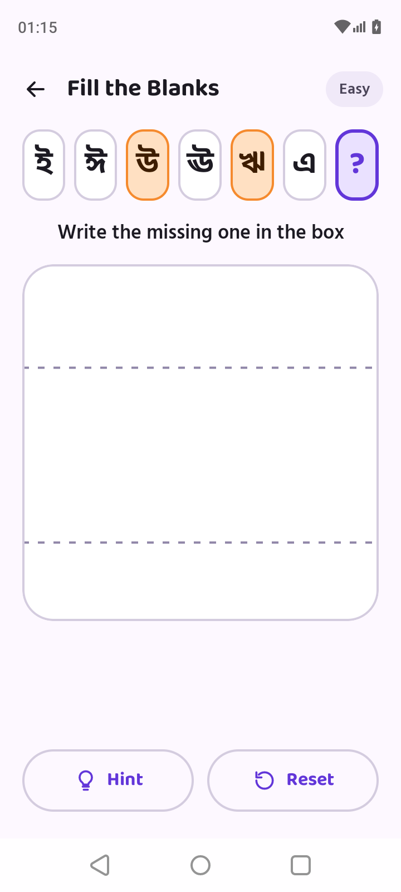

# DEFER-2 · Hide "সাহায্য" after the hint is used

**Today.** On the fill-the-blanks sequence, once the child uses Help the guide shows (score capped by
`HintRule.HINTED_SCORE_CAP`) and the Help button stays on screen, disabled.

**Spec rule.** "Prefer hiding over disabling" (BcPrimaryButton states). The design shows two equal outline
buttons: "সাহায্য" and "আবার শুরু".

**Change.** When `FillBlanksState.isHintShown` is true, the Help button is not shown and "আবার শুরু" takes the
full row width. A new blank (`attemptId` change → `isHintShown = false`) brings Help back.
No ViewModel or scoring change: rendering only.

**Tests.** A Compose UI test on the sequence content: Help visible before the hint; after `HintUsed`, Help is
absent and Reset is shown.

z**Status.** Done (Phase 8): the user chose to hide it. The test is end-to-end,
`CriticalFlowTest.fillBlanksHelp_isHiddenOnceTheHintIsUsed`.

**Process.** Before implementing, give the user a prompt describing this change; after, show before/after
screenshots.
